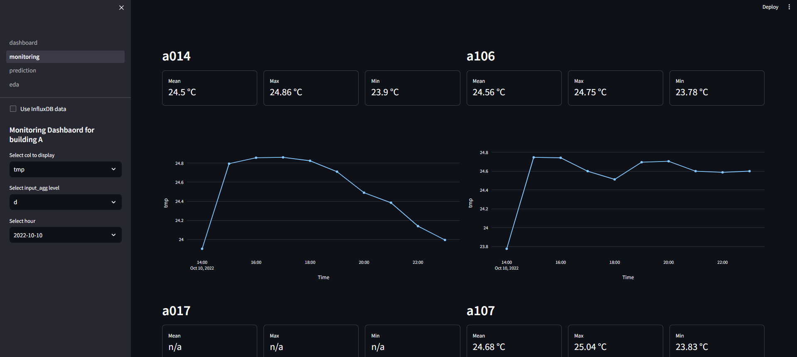
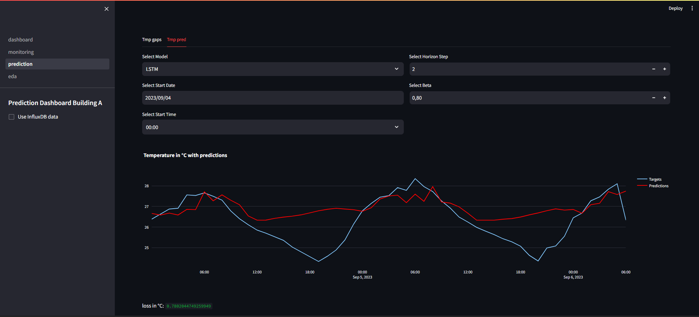
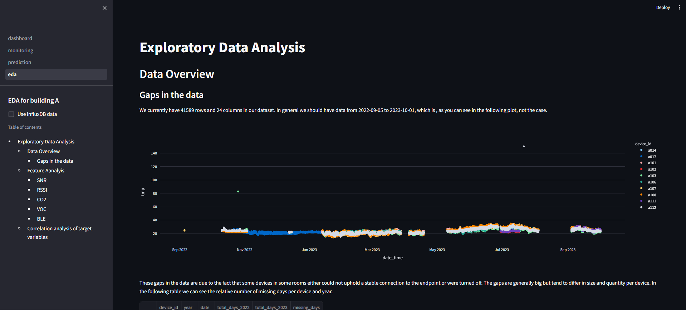

# IoT
Displaying Room features.
Doing EDA.
Predicting future values with Transformer/LSTM

* Installation
* Starting the Application

Clone repository:

git clone https://github.com/P-AEL/IoT.git

Install dependency:

pip install -r requirements.txt

Starting the dashboard:

streamlit run ./main/dashboard.py

Using the InfluxDB:

To be able to use the data from the influxdb you need to edit the credentials.json with the specific api token and write the path to this file into the variable FILEPATH_INFLUXDB_CREDENTIALS in prediction.py

Known Problems:

* The pyvista roomplot doesnt work on mac
* The describe function in the eda page creates a warning (is dependend on the pyarrow version) but doesnt afflict the functionality
* Depending on your streamlit version you might need to delete the parameters in this line: "st.container(border=True):"